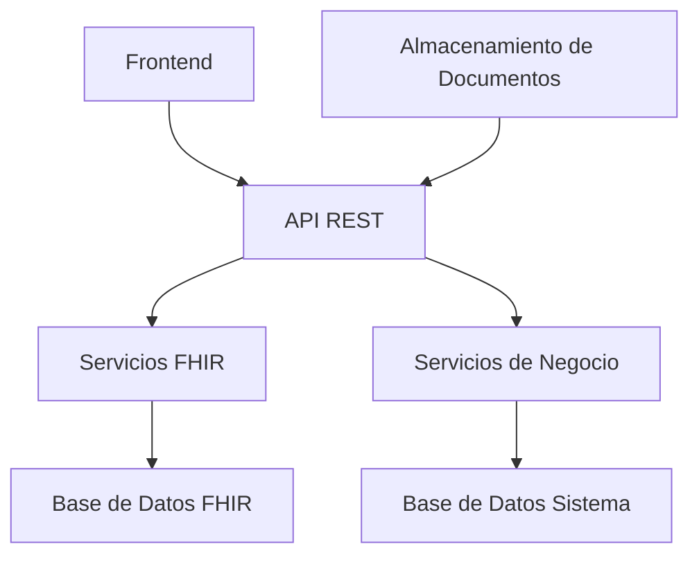
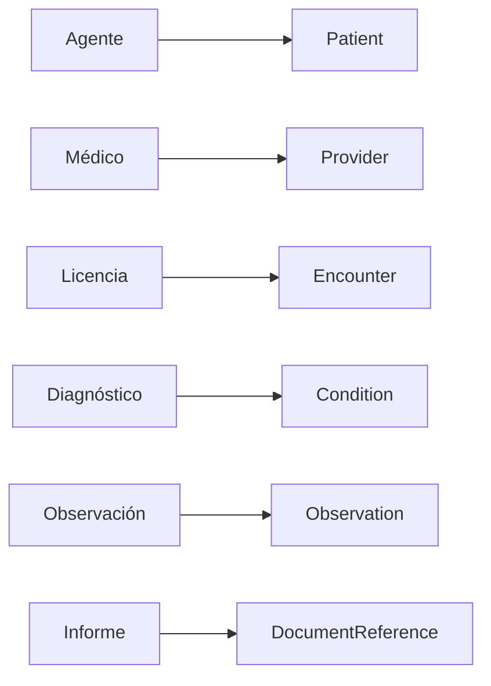

# Sistema de Licencias de Salud Ocupacional con FHIR

## Índice
1. [Introducción](#introducción)
2. [Arquitectura del Sistema](#arquitectura-del-sistema)
3. [Modelos de Datos](#modelos-de-datos)
4. [Flujos de Trabajo](#flujos-de-trabajo)
5. [Integración FHIR](#integración-fhir)
6. [Seguridad y Auditoría](#seguridad-y-auditoría)
7. [API y Endpoints](#api-y-endpoints)
8. [Consideraciones Técnicas](#consideraciones-técnicas)

## Introducción

El Sistema de Licencias de Salud Ocupacional es una aplicación que gestiona el proceso completo de licencias médicas, integrando estándares FHIR (Fast Healthcare Interoperability Resources) para garantizar la interoperabilidad con otros sistemas de salud.

### Objetivos
- Gestionar el ciclo de vida completo de licencias médicas
- Mantener registros médicos estandarizados
- Facilitar la interoperabilidad con otros sistemas de salud
- Proporcionar trazabilidad completa de las decisiones médicas
- Asegurar la confidencialidad y seguridad de los datos

## Arquitectura del Sistema

### Componentes Principales
1. **Frontend**
   - Interfaz de usuario para médicos
   - Panel de administración
   - Visualización de informes
   - Gestión de juntas médicas

2. **Backend**
   - API RESTful
   - Servicios FHIR
   - Gestión de documentos
   - Sistema de notificaciones

3. **Base de Datos**
   - Tablas FHIR
   - Tablas del sistema
   - Almacenamiento de documentos

### Diagrama de Arquitectura


## Modelos de Datos

### Entidades FHIR

#### Patient
- Representa al agente en el sistema FHIR
- Campos principales:
  - `fhir_id`: Identificador único FHIR
  - `identifier`: Identificadores del paciente
  - `name`: Información del nombre
  - `gender`: Género
  - `birth_date`: Fecha de nacimiento
  - `address`: Dirección (relacionada con fhir_addresses)
  - `telecom`: Información de contacto

#### Provider
- Representa a los médicos y profesionales de la salud
- Campos principales:
  - `fhir_id`: Identificador único FHIR
  - `npi`: Número de identificación profesional
  - `name`: Información del nombre
  - `qualification`: Calificaciones profesionales
  - `address`: Dirección profesional
  - `telecom`: Información de contacto

#### Encounter
- Representa encuentros médicos
- Campos principales:
  - `status`: Estado del encuentro
  - `class`: Clasificación del encuentro
  - `type`: Tipo de encuentro
  - `period`: Período del encuentro
  - `participant`: Participantes
  - `reasonCode`: Razón del encuentro

#### Condition
- Representa diagnósticos
- Campos principales:
  - `status`: Estado de la condición
  - `category`: Categoría del diagnóstico
  - `code`: Código del diagnóstico
  - `severity`: Severidad
  - `onsetDateTime`: Fecha de inicio
  - `abatementDateTime`: Fecha de resolución

#### Observation
- Representa observaciones médicas
- Campos principales:
  - `status`: Estado de la observación
  - `category`: Categoría
  - `code`: Código de la observación
  - `value`: Valor observado
  - `effectiveDateTime`: Fecha efectiva
  - `performer`: Realizador de la observación

#### DocumentReference
- Gestiona documentos médicos
- Campos principales:
  - `status`: Estado del documento
  - `type`: Tipo de documento
  - `category`: Categoría
  - `content_type`: Tipo de contenido
  - `content_url`: URL del documento
  - `content_hash`: Hash de verificación

### Entidades del Sistema

#### Agente
- Representa al empleado/agente
- Campos principales:
  - `idagente`: Identificador único
  - `nombre`: Nombre completo
  - `documento`: Número de documento
  - `email`: Correo electrónico
  - Relaciones con licencias y otros recursos

#### Licencia
- Gestiona las licencias médicas
- Campos principales:
  - `idlicencia`: Identificador único
  - `fecha_inicio`: Fecha de inicio
  - `fecha_final`: Fecha de finalización
  - `estado`: Estado de la licencia
  - `observaciones`: Observaciones generales

#### Junta Médica
- Gestiona las juntas médicas
- Campos principales:
  - `fecha`: Fecha de la junta
  - `tipo`: Tipo de junta
  - `estado`: Estado de la junta
  - `diagnostico`: Diagnóstico principal
  - `observaciones`: Observaciones
  - `resolucion`: Resolución de la junta

#### Informe
- Gestiona los informes médicos
- Campos principales:
  - `numero_informe`: Número único
  - `fecha_emision`: Fecha de emisión
  - `fecha_evaluacion`: Fecha de evaluación
  - `tipo_informe`: Tipo de informe
  - `contenido`: Contenido principal
  - `recomendaciones`: Recomendaciones
  - `conclusiones`: Conclusiones

## Flujos de Trabajo

### 1. Evaluación Inicial
1. El agente solicita una licencia
2. El médico (Provider) realiza la evaluación
3. Se crea un Encounter
4. Se registran Conditions (diagnósticos)
5. Se registran Observations
6. Se genera el Informe Inicial
7. Se adjuntan DocumentReferences

### 2. Proceso de Junta Médica
1. Se convoca la Junta Médica
2. Participan múltiples Providers
3. Se revisa el Informe Inicial
4. Se toman decisiones
5. Se genera una Resolución
6. Se actualiza el estado de la Licencia

### 3. Seguimiento y Continuación
1. Se generan Informes periódicos
2. Se actualizan Conditions y Observations
3. Se adjuntan nuevos DocumentReferences
4. Se registran cambios en el estado

### 4. Cierre de Licencia
1. Se genera Informe Final
2. Se actualizan todos los recursos FHIR
3. Se archivan DocumentReferences
4. Se cierra el Encounter

## Integración FHIR

### Recursos FHIR Implementados
- Patient
- Provider
- Encounter
- Condition
- Observation
- DocumentReference
- Location
- Facility

### Mapeo de Datos


### Transformaciones
- Conversión de datos locales a recursos FHIR
- Mantenimiento de referencias bidireccionales
- Validación de datos según especificaciones FHIR

## Seguridad y Auditoría

### Seguridad
- Autenticación basada en roles
- Autorización granular
- Encriptación de datos sensibles
- Protección de documentos médicos

### Auditoría
- Registro de todas las operaciones
- Trazabilidad de cambios
- Historial de versiones de documentos
- Registro de accesos

### Cumplimiento
- Ley de Protección de Datos Personales
- Estándares de seguridad médica
- Requisitos de confidencialidad

## API y Endpoints

### Endpoints FHIR
```
GET /fhir/Patient
POST /fhir/Patient
GET /fhir/Patient/{id}
PUT /fhir/Patient/{id}
DELETE /fhir/Patient/{id}
```

### Endpoints del Sistema
```
GET /api/licencias
POST /api/licencias
GET /api/licencias/{id}
PUT /api/licencias/{id}
DELETE /api/licencias/{id}
```

### Endpoints de Documentos
```
GET /api/documentos
POST /api/documentos
GET /api/documentos/{id}
PUT /api/documentos/{id}
DELETE /api/documentos/{id}
```

## Consideraciones Técnicas

### Base de Datos
- Uso de soft deletes
- Índices optimizados
- Claves foráneas
- Polimorfismo para relaciones

### Almacenamiento de Documentos
- Sistema de archivos distribuido
- Verificación de integridad
- Versionado de documentos
- Backup y recuperación

### Rendimiento
- Caché de recursos FHIR
- Paginación de resultados
- Optimización de consultas
- Monitoreo de rendimiento

### Mantenimiento
- Logs detallados
- Monitoreo de errores
- Backups automáticos
- Actualizaciones de seguridad

### Escalabilidad
- Arquitectura modular
- Microservicios
- Balanceo de carga
- Replicación de datos 